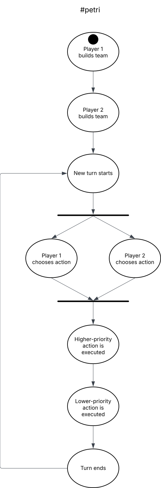

# Analisi del sistema

# Requisiti di business

Il committente richiede la progettazione di un videogame ispirato dai combattimenti tra Pokémon.

Gli obiettivi principali del seguente progetto sono:

- Offrire una esperienza di combattimento tra due giocatori offline quanto più fedele possibile a quella originale.
- Permettere l'integrazione di muove creature, mosse, abilità, effetti del campo di battaglia — ogni integrazione prenderà il nome di “Generazione” affiancato da un numero sequenziale *x* (es. Generazione 3).
- Stimolare la community a sviluppare le proprie Generazioni grazie ai *Domain Specific Language*.
- Stabilire una base di almeno 12 creature distinte, ciascuna con statistiche, tipo e set mosse coerente con un sistema di bilanciamento e fedele al gioco originale.

# Requisiti funzionali

## Di sistema

### Battaglia

- Una battaglia è uno scontro 1v1 tra 2 giocatori detti “Trainer”.
    - Ogni Trainer ha un Team composto da 1-6 Pokémon
    - Ogni Trainer può avere, in un certo istante, solamente un Pokémon in campo appartenente al suo Team.
    - Quando il Pokémon in campo di un Trainer va KO, ossia i suoi HP (Punti Salute) sono non-positivi, viene immediatamente sostituito con il prossimo Pokémon disponibile.
    - Un Trainer vince la battaglia quando tutti i Pokémon dell’avversario sono KO.

### Turni

- La battaglia si svolge a turni:
    1. Il sistema aspetta che i Trainer scelgano l’azione da eseguire.
    2. Le azioni vengono eseguite dai Pokémon in campo, in ordine decrescente secondo il parametro ‘Priorità’. Nel caso una mossa di un Pokémon A mandi KO un Pokémon B che ancora non ha eseguito la sua mosse, quella del Pokémon B non deve essere eseguita.
    3. Una volta eseguite tutte le mosse viene creato un nuovo turno

### Priorità

Quando tutti i giocatori hanno scelto un'azione, viene seguita la seguente logica per determinare chi agisce per primo:

1. Tutte le azioni scelte vengono raggruppate in base al loro livello di priorità (da -7 a +6)
2. All'interno di ogni gruppo, il Pokémon con la statistica *Velocità* (*Speed*) più alta agisce per primo. Se hanno la stessa velocità, l’ordine viene deciso casualmente.

### Switch

Durante un combattimento è possibile usare una *Mossa* oppure *Scambiare* il Pokémon in campo con uno non-KO del proprio team. L’azione di *Scambio* ha priorità +6 di default e rientra nella operazione di ordinamento delle azioni proprio come le *Mosse*.

### Pokémon

Un Pokémon è formato dalle seguenti caratteristiche:

- Un nome
- Un genere (Maschio/Femmina/Nessuno)
- 1-2 tipi
- 1-4 mosse
- 1 abilità (passiva)
- Peso, in kg
- HP (Punti Salute)
- Statistiche:
    - Attacco
    - Difesa
    - Attacco Speciale
    - Difesa Speciale
    - Velocità
- Cambiamenti di statistiche (moltiplicatori da 1/4x a 4x di una o più determinate statistiche) determinati da mosse o abilità.

### Status

Durante la battaglia i Pokémon possono subire effetti di Status di diverso tipo (ricevuti o auto-inflitti). Questi effetti di dividono in 3 macro categorie:

- *Major Status* (non volatile) — Un Pokémon può essere  sotto effetto di uno solo di questi effetti alla volta e possono essere rimossi solo da abilità o mosse curative:
    - **Burn**
        - Infligge danni: **1/16 dei HP massimi** alla fine di ogni turno.
        - Dimezza la **statistica di Attacco fisico** (a meno che il Pokémon non abbia l'abilità *Guts* o effetti particolari come *Facade*).
        - Interagisce con mosse come *Facciata* (raddoppia la potenza se il Pokémon è scottato).
    - **Badly Poison**
        - Il danno aumenta progressivamente: **1/16 dei PS al primo turno**, poi cresce di 1/16 a ogni turno successivo sul campo (es. 1/8, 3/16, ecc.).
        - Il conteggio si azzera se il Pokémon viene sostituito.
        - È causato solo dalla mossa *Tossina* o dalle sue varianti (es. *Fielepunte*).
    - **Freeze**
        - Il Pokémon **non può agire** mentre è congelato.
        - C'è una **probabilità del 20% a turno** di scongelarsi naturalmente.
        - Il congelamento termina **immediatamente** se il Pokémon viene colpito da una mossa di tipo Fuoco o usa alcune mosse specifiche (es. *Idrovampata*, *Ruotafuoco*).
    - **Paralyze**
        - **25% di probabilità** di essere **completamente incapace di agire** a ogni turno.
        - Riduce la **Velocità al 50%**
    - **Poison**
        - Subisce **1/16 dei PS massimi** di danno ogni turno.
        - Persiste indefinitamente finché non viene curato.
        - Alcune abilità lo convertono in un vantaggio (es. *Velencura*).
    - **Sleep**
        - Il Pokémon non può agire per un periodo compreso tra **1 e 3 turni**.
        - I turni trascorsi addormentati vengono **conteggiati anche se il Pokémon viene sostituito**.
        - Mosse come *Riposo* inducono il sonno automaticamente ma **ristabiliscono i PS al 100%**.
        - Può essere aggirato tramite:
            - *Sonnolalia*, che esegue una mossa casuale
            - *Russare*, che infligge danni normalmente
- *Status Volatile* — Un Pokémon può essere affetto da una pluralità di questi e che permangono sul target Pokémon finché non viene scambiato con un Pokémon nel team:
    - **Confusion**
        - Dura da **1 a 4 turni**.
        - Il Pokémon ha il **33% di probabilità** di colpirsi da solo invece di usare una mossa.
        - Il danno da auto-colpo è pari a un attacco fisico **senza tipo** con **potenza base 40**, usando la propria statistica di Attacco.
    - **Yawn**
        - Dopo **1 turno**, il Pokémon bersaglio si addormenta, a meno che non venga sostituito.
    - **ProtectEndure**
        - Blocca le mosse che hanno come bersaglio questo Pokémon.
        - **Riduce progressivamente la probabilità di successo**: 100% → 50% → 25%, ecc.
- *Special Volatile* — Sono Status particolari che vengono creati da specifiche mosse:
    - **Yawn**
        - Dopo 1 turno, il Pokémon bersaglio cadrà addormentato, a meno che non venga sostituito.

### Mosse

Le mosse, caratterizzate da

- Nome
- Tipo
- Categoria (*fisica*, *speciale*, di *status*)
- Potenza
- Accuratezza (può essere `0-100%` oppure `-` per le mosse che non falliscono mai).
- PP (Punti Potenza) che indica il numero di volte in cui la mossa è utilizzabile durante la battaglia. Ad ogni utilizzo, sia in caso di successo che di fallimento, il numero viene decrementato. Utilizzare una mossa con PP esauriti causerà il fallimento certo della mossa.
- Target (*Nemico*, *Se stesso*)
- Un comportamento in caso di successo ed uno in caso di fallimento.
Un comportamento è un effetto o combinazione di effetti, eventualmente anche con modificatori come probabilità di applicazione e selezione del target. Possibili comportamenti sono:
    - Danno
    - Cura
    - Condizione di Status
    - Cambiamento delle statistiche
    - Cambiamento degli effetti del campo di battaglia

### Efficacia dei tipi

Come detto nelle precedenti sezioni, una mossa ha 1 tipo mentre un Pokémon può averne più di 1.

Un tipo può essere verso un altro tipo: 

- Neutrale — la potenza della mossa rimane invariata (1x)
- Inefficace — la potenza della mossa viene dimezzata (0.5x)
- Immune — la potenza della mossa viene annullata (0x)
- Super efficace — la potenza della mossa viene raddoppiata (2x)

Le relazioni di efficacia trai i vari tipi sono espressi nella seguente matrice:


### Danno

Il danno viene calcolato ogni volta che una mossa colpisce l’avversario, si segue la seguente formula:

```scala
Damage = BaseDamage * Multipliers
```

dove:

```scala
BaseDamage = MovePower * SourceStat / TargetStat / 25 + 3
```

La formula è variata dalla originale poiché in questo progetto non si sviluppa la crescita in livelli dei Pokémon, perciò è stato rimosso il fattore Livello dal calcolo del danno e sono stati ridimensionati altri fattori per controbilanciare.

I fattori della formula sono i seguenti:

- `UserStat`: la statistica di Attacco o Attacco Speciale dell’utilizzatore, a seconda della categoria della mossa.
- `TargetStat`: la statistica di Difesa o Difesa speciale del bersaglio, sempre in base alla categoria della mossa.
- `UserStat` e `TargetStat` devono avere già applicati eventuali **modificatori di statistica**
- `Multipliers` è il prodotto totale di tutti i moltiplicatori, tra cui:
    - **STAB** (bonus dello stesso tipo)
        - Se il tipo della mossa coincide con quello dell’utilizzatore ⇒ ×1.5
        - Se l’utilizzatore ha anche l’abilità *Adattabilità (Adaptability)* ⇒ ×2
    - **Efficacia del tipo**
    - **Fattore casuale**
        - Moltiplicatore casuale tra **0.85 e 1.0**
        - Viene scelto ogni volta che la mossa colpisce

### Campo di battaglia

Il campo di battaglia è formato da tante sotto porzioni quanti sono i Trainer in campo (detti *Side*), ogni *Side* può essere affetto da condizioni che si ripercuotono sul Pokémon proprietario di quel *Side*, ad esempio:

- **Spikes**
    - Danneggia i Pokémon avversari quando entrano in campo.
    - 1 livello: **12,5%** dei PS
    - 2 livelli: **25%** dei PS
    - 3 o più livelli: **37,5%** dei PS
    - **Nessun effetto** sui Pokémon **non ancorati al suolo** (es. di tipo Volante o con *Levitazione*)
- **Stealth Rock**
    - Danneggia i Pokémon avversari quando entrano in campo.
    - Il danno **dipende dalla debolezza del bersaglio al tipo Roccia**, secondo la seguente regola:
        
        ```scala
        MaxHP * 1/8 * EffectivenessMultiplier
        ```
        
        - Nessun effetto se il Pokémon è **immune al tipo Roccia** (caso raro).

È possibile avere più condizioni su uno Stesso *Side* e sono temporali.

Il campo di battaglia può essere caratterizzato da un *Weather*, un *Terrain* ed un *Room*. Questi effetti influenzano tutti i Pokémon in campo, sono temporanei e può esistere un solo effetto per tipo alla volta —  se è già presente un effetto questo può essere sovrascritto.

- ***Weather*** — hanno effetto per 5 turni e possono essere creati da una Abilità o una Mossa
    - *Sunny*
        - Le mosse di tipo Fuoco infliggono ×1.5 danni
        - Le mosse di tipo Acqua infliggono ×0.5 danni
    - *Rain*
        - Le mosse di tipo Acqua infliggono ×1.5 danni
        - Le mosse di tipo Fuoco infliggono ×0.5 danni
    - *Sandstorm*
        - Danneggia tutti i Pokémon che non sono di tipo Roccia, Acciaio o Terra
        - Aumenta la Difesa Speciale dei Pokémon di tipo Roccia di ×1.**5**
    - Snow
        - Danneggia tutti i Pokémon che non sono di tipo Ghiaccio
- ***Terrain*** — hanno effetto per 5 turni e possono essere creati da una Abilità o una Mossa
    - *Grassy Terrain*
        - Le mosse di tipo Erba infliggono ×1.5 danni
        - Cura 1/16 dei PS di ogni Pokémon a turno
    - *Electric Terrain*
        - Le mosse di tipo Elettro infliggono ×1.5 danni
        - Impedisce il sonno ai Pokémon
    - *Psychic Terrain*
        - Le mosse di tipo Psico infliggono ×1.5 danni
    - *Misty Terrain*
        - Le mosse di tipo Drago infliggono ×0.5 danni
- ***Room*** — hanno effetto per 5 turni e possono essere creati da una Abilità o una Mossa
    - *Trick Room*
        - Inverte l’ordine delle mosse all’interno di ogni livello di priorità: i Pokémon più lenti attaccano prima dei più veloci.

### Abilità

Le abilità sono effetti passivi che possono venire attivate in diverse fasi del combattimento:

- **All’ingresso in campo** (es. *Intimidate*, *Drizzle*)
- **Quando si subisce danno** (es. *Static, Poison Touch*)
- **All’inizio di ogni turno** (es. *Speed Boost*)
- **Alla fine di ogni turno** (es. *Poison Heal*)
- **Alla sconfitta del Pokémon** (es. *Aftermath*)
- **Permanenti/passive** (e.g. *Levitate*)

### Team builder

Prima dell’inizio della battaglia, i team partecipanti in essa vengono costruiti da uno strumento interattivo.

## Utente

- Il gioco si svolge in modalità multigiocatore locale: entrambi gli utenti interagiscono con il medesimo terminale, attraverso la tastiera.
- All’avvio del software gli utenti potranno formare il loro team, fornendo il nome del Trainer e selezionando fino a 6 Pokémon partecipanti.
- Durante la battaglia, i giocatori possono visualizzare a schermo, in un’interfaccia grafica minimale, lo stato corrente della battaglia, contenente:
    - Pokémon in campo: nome, HP, abilità, status, eventuali cambiamenti di statistiche;
    - Mosse del Pokémon in campo: nome, tipo, categoria, accuratezza, PP, e tasto da premere per selezionarla;
    - Pokémon in panchina: nome e tasto da premere per selezionare la sostituzione;
    - Weather, Terrain e Room corrente;
    - Numero del turno corrente, partendo da 1.
- Al momento della scelta delle azioni (mosse o sostituzione) per il loro Pokémon in campo, premere il tasto corrispondente mostrato a video la selezionerà. Un utente può selezionare una sola mossa per turno, ma può sovrascriverla finché tutti i giocatori avranno terminato la selezione.



### Esempio di battaglia

- Team Alice: Pikachu, Gyarados
- Team Bob: Metagross, Tyranitar

1. Turno 1
    1. Pikachu usa *Thunderwave* per paralizzare Metagross
    2. Metagross usa *Earthquake*, superefficace su Pikachu
2. Turno 2
    1. Metagross è paralizzato e dunque la sua velocità è ridotta, ma utilizza *Bullet Punch* che è una mossa di priorità 1, finendo per attaccare ugualmente prima di Pikachu, qualunque mossa lui abbia scelto.
    2. Pikachu va KO e Gyarados viene mandato in campo al suo posto. Avendo attaccato prima, Metagross non ha ricevuto danno.
    3. Gyarados ha l’abilità *Intimidate* che, quando mandato in campo, riduce l’attacco dell’avversario di uno stage. Metagross ha tuttavia l’abilità *Clear Body* che impedisce che le sue statistiche vengano abbassate, dunque annichilendo *Intimidate*.
3. Turno 3
    1. Gyarados usa *Dragon Dance*, che aumenta le sue statistiche di attacco e velocità di 1.5x.
    2. Metagross usa *Psychic*.
4. Turno 4
    1. Gyarados usa ancora *Dragon Dance*, portando le sue statistiche di attacco e velocità a 2x.
    2. Metagross usa *Zen Headbutt*.
5. Turno 5
    1. Gyarados usa *Grass Knot*, mossa particolarmente efficace contro target pesanti come Metagross.
    2. Metagross usa *Zen Headbutt*.
6. Turno 6
    1. Gyarados usa un’altra volta *Dragon Dance*, portando attacco e velocità a 2.5x.
    2. Metagross viene sostituito per Tyranitar, che grazie alla sua abilità *Sand Stream* provoca un *sandstorm*.
7. Turni 7-8
    1. Gyarados usa *Grass Knot*, che grazie all’efficacia 4x su Tyranitar (Erba vs Roccia/Terra), il suo elevato peso, ed il moltiplicatore di attacco di Gyarados a 2.5x, manda l’avversario KO.
    2. Metagross entra in campo.
8. Turni 9-10
    1. Gyarados usa *Earthquake*, superefficace sul tipo acciaio di Metagross, mandandolo KO.
    2. Bob non ha più Pokémon disponibili ed Alice vince la battaglia.

## Caratteristiche aggiuntive

- Combattimento 1vCPU
- Funzionalità Torneo

## Requisiti non funzionali

- Un'interfaccia grafica minimale e intuitiva, per garantire l'accessibilità anche ai giocatori meno esperti.
- I tempi di risposta dell'interfaccia devono essere inferiori a 200 ms, per mantenere un'esperienza utente fluida e reattiva.
- I tempi di caricamento dei turni non devono superare un secondo.

## Requisiti di implementazione

- Il codice deve essere modulare, per facilitare l’aggiunta di nuovi Pokémon, mosse e altri elementi di gioco.
- Verranno utilizzati design pattern per separare la logica di gioco, l’interfaccia utente e i dati. In particolare, sarà adottato il pattern MVC (Model-View-Controller) a questo scopo.
- Ogni componente dovrà essere facilmente testabile in isolamento.
- Il gioco verrà implementato interamente in Scala e testato tramite la libreria Scalatest.
- Per quanto riguarda l’interfaccia grafica della battaglia, verrà adottata la libreria AsciiPanel sviluppata da Trystan Spangler ([https://github.com/trystan/AsciiPanel](https://github.com/trystan/AsciiPanel)).
- L’interfaccia grafica del team builder è basata sul terminale, ed il team di Pokémon selezionati viene espresso dall’utente come una sequenza di caratteri, in cui ogni carattere corrisponde ad un Pokémon definito nel modello.

# Modello di dominio

Sulla base dei requisiti precedentemente spiegati emergono i seguenti diagrammi di analisi:

Pokémon:


---

Battaglia:


---

Azioni:

