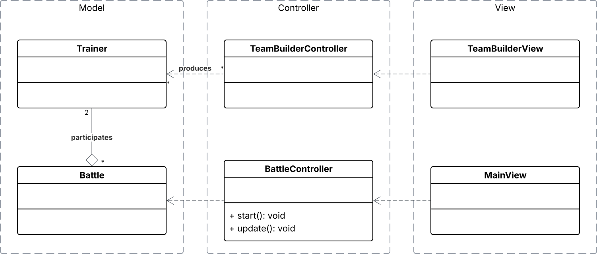
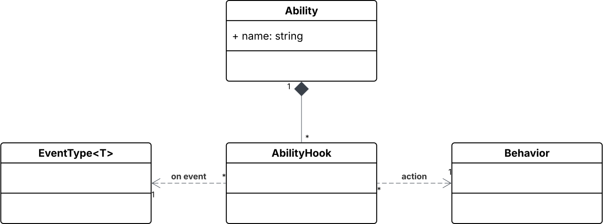

# Design architetturale

## **Architettura complessiva**

Il software si compone di due sotto-sistemi indipendenti:

- Team builder, relativamente piccolo;
- Battaglia PvP a turni.

Entrambi si fondano su un’architettura MVC e raggiungono un punto di intersezione in `Trainer`, in quanto prodotto del team builder e input della battaglia: sarà infatti sulla base degli allenatori partecipanti, e quindi sulla loro squadra, che la battaglia può svolgersi in modi sempre diversi.

In entrambi i sistemi il controller risulta minimale, in quanto componente di transizione ed elaborazione degli input utente, piuttosto che componente attivo.

### Pokémon

Come anticipato in fase di analisi, una specie di Pokémon è definita dalle intrinseche proprietà fondamentali:

Mosse ed abilità sono modellate come di seguito, con il loro comportamento rappresentato da dei `Behavior`, componenti flessibili che permettono di esprimere le conseguenza che l’esecuzione di una mossa avrà sullo stato della battaglia. Una descrizione approfondita dei behaviors verrà trattata in *Design di dettaglio*.

Mentre le mosse sono azionate solo al bisogno, le abilità passive possono essere attivate da un qualunque evento. Per questo il loro comportamento fa riferimento a degli `EventType` (approfonditi nella sezione *Eventi*).

Un’istanza di un Pokémon utilizzabile in battaglia raggruppa proprietà che possono essere alterate nel corso della battaglia: punti vita (HP), status (es. paralizzato, avvelenato), cambiamenti dinamici di statistiche e usabilità delle mosse (PP).

Al fine di limitare i side effects all’interno del software, i Pokémon, insieme a diverse altre proprietà della partita, sono entità *immutabili* ed il punto di mutabilità risiede in uno stato esterno (`Battle`).

### Battaglia

Il motore della battaglia ruota attorno alla classe `Battle`, che vuole essere l’unico punto di mutabilità del modello. La battaglia tiene traccia dello stato corrente e consente la sua evoluzione.

I turni della battaglia sono rappresentati da una pila di turni, in cui l’elemento più recente rappresenta il turno corrente, e quindi quello da far avanzare. Ogni chiamata ad `update()` effettua il passaggio dal `TurnStage` corrente al successivo: in ordine `Started`, `WaitingForActions`, `ActionsReceived`, `ExecutingActions`, `Ended`. Finito il ciclo di stage, un nuovo turno è inizializzato.

È in `BattleState` che risiede il cuore del gioco: tale classe rappresenta un istante della battaglia, come uno snapshot, che contiene tutte le informazioni necessarie sui Pokémon in battaglia e sul campo di gioco.

Data la natura immutabile, sarebbe assolutamente possibile ripercorrere una partita interamente dalla fine all’inizio, come in un video in riproduzione inversa, partendo dalla cima dello stack e ‘sfogliando’ tutti i `BattleState`.

### Gestione degli input

Ad ogni turno, l’utente ha due possibili opzioni: eseguire una mossa del Pokémon corrente o sostituirlo. Tali azioni, `Move` e `Switch`, sono delle `Action` che possono essere registrate in un `ActionBuffer`. Il buffer è immutabile ed è aggiornato internamente dal `BattleController` a patto che il turno di battaglia corrente sia `WaitingForActions`. Una volta che tutti gli allenatori hanno registrato un’azione, il controller farà avanzare la battaglia allo stage `ActionsReceived`, con riferimento al buffer di azioni da eseguire.

### Eventi

Il dominio è estremamente focalizzato sugli eventi. Ad esempio un’abilità può provocare degli effetti quando il Pokémon è colpito dall’avversario, quando un turno inizia, finisce, o qualsiasi altro evento che può verificarsi durante la battaglia.

A fine di fornire flessibilità e scalabilità, il sistema adotta una versione estesa dell’observable pattern, il quale consente a qualunque componente di aspettare reattivamente (`watch`) il verificarsi (`notify`) di un certo tipo di evento attraverso l’`EventManager` della battaglia.

