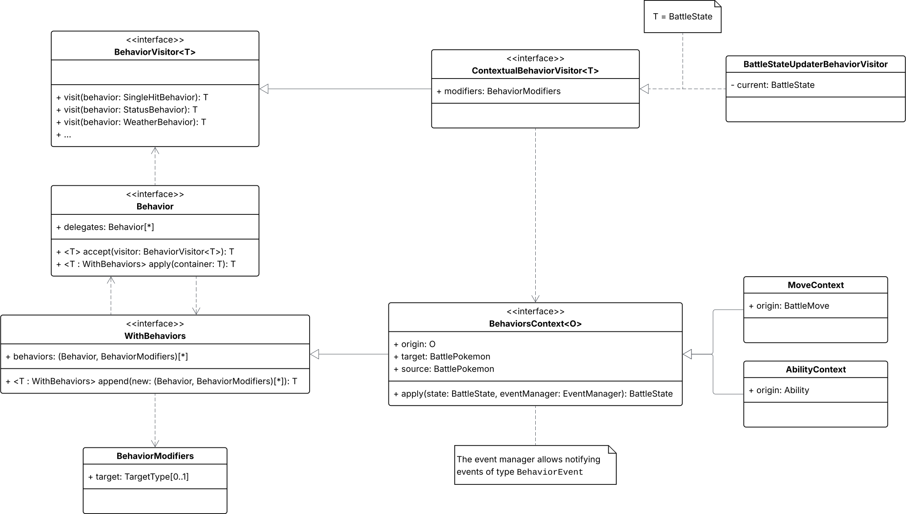
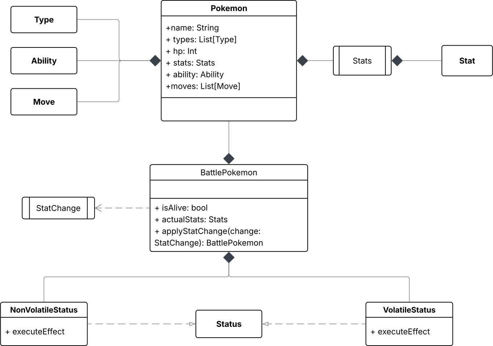
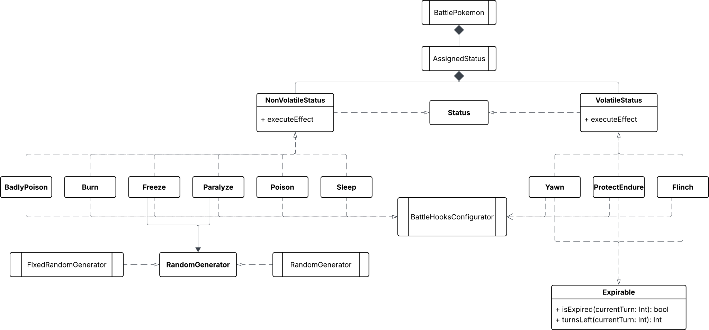

# Implementazione

# Elvis Perlika

## Types

L’interfaccia `Type` rappresenta il contratto comune che tutti i tipi devono rispettare. Essa definisce:

- Le relazioni tra tipi (efficacia, resistenza, inefficacia).
- I metodi per il calcolo dell’efficacia (`computeEffectiveness`, `computeSingleEffectiveness`).

L’enumerazione `Efficacy` modella i quattro livelli di efficacia possibili:

- `SuperEfficacy`, `Efficacy`, `Resisted`, `Ineffective`
    
    Ogni caso ha associati un valore numerico e una rappresentazione testuale.
    

`TypeUtility` fornisce la funzionalità ausiliaria:

- `calculateTypeMultiplier` che prende una lista di `Efficacy` e calcola il **moltiplicatore finale** per l’attacco, utile per attacchi contro bersagli con più tipi (es. *Grass/Steel*).

  

## Campo di battaglia

Il campo di battaglia è uno spazio dinamico, continuamente modificato dai Pokémon in lotta e, a sua volta, capace di influenzarne comportamenti, strategie e regole di gioco.

Per garantire la massima flessibilità nella definizione degli effetti del campo, *Terrain*, *Weather*, *Room* e *Side Condition* sono stati modellati come **Mixin di strategie**. Questa scelta consente di comporre il comportamento di ciascun effetto combinando diverse funzionalità, evitando gerarchie rigide e favorendo un approccio modulare ed estensibile.

A questa struttura possono essere aggiunti diversi comportamenti attraverso mixin opzionali:

- `FieldEffect` definisce attributi base come il **nome**, la **descrizione** e il **turno di creazione** dell’effetto.
- `Hooks`: permette di associare mutazioni filtrare dei Pokémon in campo (`PokemonRule`) ad eventi specifici (`EventType`), che verranno eseguite al loro verificarsi.
- `TypesModifier`: consente di alterare i moltiplicatori di danno per uno o più tipi (`Type`) durante la durata dell’effetto.
- `MutatedBattleRule`: permette di sostituire una regola della battaglia attiva con un’altra (`BattleRule`).
- `Expirable`: introduce un limite di durata in turni all’effetto, calcolando dinamicamente se è ancora attivo e quanti turni mancano alla sua conclusione.

Questa modellazione rende possibile rappresentare in modo flessibile e composabile effetti come *Trick Room*, *Rain*, Misty o Sandstorm, ognuno dei quali può influenzare il gioco in modi diversi e con durata limitata o persistente.

Attraverso questa architettura modulare, il sistema è in grado di gestire comportamenti complessi senza ricorrere a ereditarietà rigide o logiche speciali codificate manualmente, rendendo l’estensione e la manutenzione del motore di gioco più semplice e scalabile.

Di seguito alcuni esempi di effetti del campo di battaglia:

- *TrickRoom*
    
    ```scala
    case class TrickRoom(t: Int) extends Room with FieldEffect(t)
        with Expirable(t, TrickRoom.Duration) with MutatedBattleRule:
      override val description: String = TrickRoom.Description
      override val rule: BattleRule = Tricky()
      override val name: String = TrickRoom.Name
    
    object TrickRoom:
      val Name: String = "Trick Room"
      val Description =
        "Reverses move orders within each priority level, so that slower Pokémon move before faster ones."
      val Duration: Int = 5
      def apply(t: Int): TrickRoom = new TrickRoom(t)
    ```
    
- *Snow*
    
    ```scala
    case class Snow(t: Int)
        extends Weather
        with FieldEffect(t)
        with Hooks
        with Expirable(t, Snow.Duration):
      override val description: String = Snow.Description
      override val hooks: List[(EventType[_], PokemonRule)] =
        (
          CreateWeather,
          Modify.except(Ice) { p => p.copy(currentHP = p.currentHP - Snow.Damage) }
        ) :: Nil
      override val name: String = Snow.Name
    
    object Snow:
      val Name = "Snow"
      val Damage: Int = 10
      val Description: String = "Snow boosts Ice-type defense."
      val Duration: Int = 5
      def apply(t: Int): Snow = new Snow(t)
    ```
    
- *Misty*
    
    ```scala
    case class Misty(t: Int)
        extends Terrain
        with FieldEffect(t)
        with TypesModifier
        with Expirable(t, Misty.Duration):
      override val description: String = Misty.Description
      override val typesModifier: Map[Type, Double] =
        Map(Dragon -> Misty.DragonModifier)
      override val name: String = Misty.Name
    
    object Misty:
      val Name = "Misty"
      val DragonModifier: Double = 0.5
      val Description: String = "Misty weakens Dragon Pokémon."
      val Duration: Int = 5
      def apply(t: Int): Misty = new Misty(t)
    ```


### Hooks

Il mixin *Hooks* si basa sulla funzione `hookBattleStateUpdate`, poiché le regole che modificano lo stato dei Pokémon (*PokemonRule*) devono essere attivate in risposta a specifici eventi e rimanere attive finché l’effetto di campo è presente.

Quando viene creato un nuovo *Weather* (e vale lo stesso per *Room*, *Terrain* e *SideCondition*), si estraggono gli *Eventi* e le *PokemonRule* associati. Per ciascuno di essi, viene registrata una **callback** tramite `hookBattleStateUpdate`, che verrà eseguita ogni volta che l’evento specifico si verifica, **ma solo se** il *Weather* (o *Room*, *Terrain,* *SideCondition*) attivo sul campo corrisponde a quello che ha definito gli *hooks*.

In questo modo, gli effetti dinamici del campo restano consistenti e vengono applicati solo mentre il corrispondente *Weather* è attivo.

```scala
def hookWeatherEffects[T <: Weather with Hooks](o: T): Unit =
  o.hooks.foreach: pokemonRule =>
    val (event, rule) = pokemonRule
    battle.hookBattleStateUpdate(event) { (state, _) =>
      state.field.weather match
        case Some(`o`) =>
          state.copy(trainers = updateTeam(state.trainers, rule))
        case _ => state
    }
```

### PokemonRule

Gli effetti del campo di battaglia influenzano i Pokémon in modo diverso a seconda del loro tipo. Per questo motivo è stata sviluppata una funzione di filtraggio basata sul tipo, che consente di applicare modifiche selettive ai Pokémon. Di seguito sono riportati alcuni esempi di utilizzo.

- *Riduci la vita di una certa quantità per tutti i Pokémon non di tipo ghiaccio*
    
    ```scala
    Modify.except(Ice) { p => p.copy(currentHP = p.currentHP - Snow.Damage)
    ```
    
- *Riduci la vita di tutti i Pokémon in campo in base alla loro debolezza rispetto alle mosse di tipo Roccia*
    
    ```scala
    Modify.all { p =>
        p.copy(currentHP =
          p.currentHP - (DamagePercentage.percent of p.currentHP * TypeUtility.calculateTypeMultiplier(
            Rock.computeEffectiveness(p.base.types)
          ).toInt)
        )
    }
    ```


### MutatedBattleRule

Il mixin *MutatedBattleRule* (tipicamente utilizzato con le *Room*)  **trasporta una versione mutata delle regole che governano il gioco che, allo stesso modo degli Hooks visti precedentemente, devono rimanere valide fin tanto che l’effetto che implementa il mixin è parte del campo di battaglia:

```scala
def hookRoomBattleRules[T <: Room with MutatedBattleRule](o: T): Unit =
  battle.hookBattleStateUpdate(Started) { (state, t) =>
    state.field.room match
      case Some(`o`) => state.copy(rules = o.rule)
      case _         => state.copy(rules = battle.rules)
  }
```


### Expirable

Il mixin *Expirable* serve per costruire effetti con un durata definita. Ad ogni turno viene eseguita una funziona che controlla tutti gli effetti del campo di battaglia che estendono questo trait e restituiscono una copia del stato della battaglia senza gli effetti che hanno terminato il loro periodo di durata.

```scala
def updateBattlefield(state: BattleState): BattleState =
  import it.unibo.skalamon.model.battle.ExpirableSystem.removeExpiredEffects
  state.copy(
    field = state.field.removeExpiredEffects(battle.turnIndex)
  )
```

### Side Condition

Le Side Condition applicabili a una porzione del campo di battaglia (lato di un Trainer) possono appartenere a due categorie distinte:

1. Side Condition esclusive (singolo livello)
    - Solo una condizione di questo tipo può essere attiva contemporaneamente per ogni specifico effetto.
    - Se una nuova condizione dello stesso tipo viene applicata, sostituisce quella esistente.
2. Side Condition a livelli
    - Possono essere applicate più volte.
    - Ogni nuova applicazione aumenta il numero di livelli (layer), potenziando l’effetto complessivo della condizione.
    - Hanno un limite massimo di livelli.

Questa distinzione è stata implementata andando ad ampliare il Mixin integrando il trait `AddConstraint`.


```scala
trait Unique[E] extends AddConstraint:
  def classTag: ClassTag[E]
  override def canAdd(existing: List[SideCondition]): Boolean =
    !existing.exists(e => classTag.runtimeClass.isInstance(e))
    
    
trait Multi[E](limit: Int) extends AddConstraint:
  def classTag: ClassTag[E]
  override def canAdd(existing: List[SideCondition]): Boolean =
    existing.count(e => classTag.runtimeClass.isInstance(e)) < limit
```

Il trait è **parametrizzato** con un tipo generico `E`, che rappresenta il tipo specifico di `SideCondition` per cui si vuole garantire l'unicità o la molteplicità.

## Ordinamento mosse

Per determinare l’ordine di esecuzione delle azioni in un turno di battaglia, il sistema utilizza una strategia di ordinamento definita tramite il trait `BattleRule`, che espone il campo:

```scala
val actionOrderStrategy: Ordering[Action]
```

L’ordinamento concreto viene fornito tramite istanze implicite definite con **`given`**. Queste istanze rappresentano diverse logiche di ordinamento, e sono dichiarate nel package `event.config`:

- `ClassicOrdering.given_Ordering_Action`: ordina per priorità e poi per velocità (veloce prima).
- `InvertedSpeedOrdering.given_Ordering_Action`: ordina per priorità e poi per velocità inversa (lento prima), utile ad esempio per effetti come *Trick Room*.

Ogni implementazione di `BattleRule` (es. `Classic`, `Tricky`) assegna alla strategia `actionOrderStrategy` l’ordinamento desiderato attraverso il relativo `given`, come mostrato:


```scala

trait BattleRule:
  val actionOrderStrategy: Ordering[Action]
  
case class Classic() extends BattleRule:
	override val actionOrderStrategy: Ordering[Action] =
	    ClassicOrdering.given_Ordering_Action
	    
case class Tricky() extends BattleRule:
	override val actionOrderStrategy: Ordering[Action] =
	    InvertedSpeedOrdering.given_Ordering_Action
```

# Giorgio Garofalo

## Behaviors

Un’ottima gestione dei behaviors è un punto cruciale del progetto al fine di garantire flessibilità e non-ripetizione quando si modellano nuove mosse o abilità.

1. **Modellazione**
    
    La modellazione dei comportamenti avviene attraverso behaviors di azione e behaviors modificatori:
    
    - Di azione:
        - `SingleHitBehavior` (applica un singolo colpo con una potenza di base, usata nel calcolo del danno)
        - `MultiHitBehavior` (come per il singolo colpo, ma ripetuto N volte)
        - `HealthBehavior` (imposta la vita ad N HP)
        - `HealBehavior` (ripristina N HP)
        - `DamageBehavior` (sottrae N HP)
        - `StatusBehavior` (imposta o rimuove uno status)
        - `StatChangeBehavior` (potenzia o indebolisce una statistica)
        - `WeatherBehavior`, `TerrainBehavior`, `RoomBehavior`, `SideConditionBehavior` (imposta un effetto del campo di battaglia)
    - Modificatori:
        - `BehaviorGroup` (applica più behavior alla volta)
        - `ProbabilityBehavior` (applica una probabilità che si verifichi il behavior)
        - `RandomModifier` (applica un behavior con un input random tra due bounds, ad esempio il numero di colpi di una `MultiHitBehavior`)
        - `TargetModifier` (imposta il target del behavior, che di default è il Pokémon nemico, ma può essere sovrascritto al Pokémon sorgente)
    
    I modificatori sono componibili, spesso per mezzo di mixin, in modo da permettere una modellazione come nel seguente esempio:
    
    ```scala
    BehaviorGroup(
    	new BehaviorGroup(
    		new SingleHitBehavior(power = 50),
    		new StatusBehavior(Burn())
    	) with ProbabilityModifier(80.percent),
    	new RandomModifier(2, 5)(MultiHitBehavior(hits = _, power = 50))
    		with TargetModifier(TargetModifier.Type.Self)
    )
    ```
    
2. **Flattening**
    
    Dato un contesto di esecuzione di una mossa o abilità, invocare `behavior(context)` produce una copia di `context` con tale behavior applicato ad esso.
    
    Per poter effettuare questa operazione, avviene una semplificazione dalla fase di modellazione:
    
    - I modificatori come `ProbabilityModifier` e `RandomModifier` vengono valutati ed appiattiti;
    - `TargetModifier` viene appiattito ed il suo valore viene salvato in un record `BehaviorModifiers` associato al behavior corrispondente;
    - Behavior derivati delegano il loro comportamento a behavior primitivi attraverso il template method opzionale `delegates`. Ad esempio, una `MultiHitBehavior` con N colpi delega il suo comportamento ad N `SingleHitBehavior`.
3. **Esecuzione**
    
    Ottenuto il contesto di esecuzione decorato dai behavior, è necessario avere un modo per applicarlo alla battaglia per ottenere un nuovo stato. Questo viene effettuato dal `BattleStateUpdaterBehaviorVisitor`, che per ogni behavior primitivo crea un nuovo snapshot dello stato della battaglia, basandosi anche sui `BehaviorModifiers` forniti.
    
    Inoltre, l’esecuzione di un behavior notifica l’`EventManager` di un `BehaviorEvent[T]`, che può essere ascoltato tramite reificazione del tipo di behavior, ad esempio: `eventManager.watch(BehaviorEvent[StatusBehavior])(...)`




## DSL

Il progetto contiene tre tipi di DSL utilizzati per costruire oggetti usando un builder sottostante, ed ognuno impiegato nella sua *factory* corrispondente:
*Di seguito sono mostrati gli elementi più interessanti dal punto di vista della modellazione.*

- Pokémon:
    
    ```scala
    def yanmega: Pokemon =
      pokemon("Yanmega"):
        _ typed Bug + Flying hp 86 weighing 51.5.kg ability speedBoost 
    	  stat Attack -> 76 stat Defense -> 86 stat SpecialAttack -> 116
    	  stat SpecialDefense -> 56 stat Speed -> 95
    	  moves (
          bugBuzz,
          protect,
          sunnyDay
        )
    ```
    
- Mosse:
    
    Mossa che causa un danno elevato ma riduce le statistiche dell’attaccante:
    
    ```scala
    def superpower: Move =
      move("Superpower", Fighting, Physical):
        _ pp 5 onSuccess groupOf(
          SingleHitBehavior(120),
          new BehaviorGroup(
            StatChangeBehavior(Attack - 1),
            StatChangeBehavior(Defense - 1)
          ) with TargetModifier(Self)
        )
    ```
    
    Mossa che danneggia l’attaccante se fallisce:
    
    ```scala
    def highJumpKick: Move =
      move("High Jump Kick", Fighting, Physical):
        _ pp 10 accuracyOf 90.percent onSuccess (_ =>
          SingleHitBehavior(130)
        ) onFail (context =>
          DamageBehavior(context.source.base.hp / 2)
        )
    ```
    
    Mossa che danneggia l’avversario e ha una piccola probabilità di ridurre una sua statistica:
    
    ```scala
    def bugBuzz: Move =
      move("Bug Buzz", Bug, Special):
        _ pp 10 onSuccess groupOf(
          SingleHitBehavior(90),
          new StatChangeBehavior(SpecialDefense - 1)
            with ProbabilityModifier(10.percent)
        )
    ```
    
    Mossa che danneggia l’avversario ed ha una piccola probabilità di paralizzarlo:
    
    ```scala
    def thunderbolt: Move =
      move("Thunderbolt", Electric, Special):
        _ pp 15 onSuccess groupOf(
          SingleHitBehavior(90),
          new StatusBehavior(_ => Paralyze()) with ProbabilityModifier(10.percent)
        )
    ```
    
    Mossa che dimezza gli HP dell’avversario:
    
    ```scala
    def superFang: Move =
      move("Super Fang", Normal, Physical):
        _ pp 10 onSuccess: context =>
          DamageBehavior(context.target.currentHP / 2)
    ```
    
    Mossa che cura l’utente e lo addormenta:
    
    ```scala
    def rest: Move =
      move("Rest", Psychic, Status):
        _ pp 10 onSuccess: context =>
          new BehaviorGroup(
            HealthBehavior(context.source.base.hp),
            StatusBehavior(_ => Sleep())
          ) with TargetModifier(Self)
    ```
    
    Mossa che provoca danno in base al peso dell’avversario:
    
    ```scala
    def grassKnot: Move =
      move("Grass Knot", Grass, Special):
        import scala.math.{log10, max, min}
        _ pp 20 onSuccess: context =>
          val power =
            10 * min(120, max(20, 60 * log10(context.target.base.weightKg) - 40))
          SingleHitBehavior(power.toInt)
    ```
    
- Abilità:
    
    Abilità che causa pioggia quando l’utente entra in campo:
    
    ```scala
    def drizzle: Ability =
      ability("Drizzle"):
        _.on(ActionEvents.Switch): (source, _, switch) =>
          if switch.in is source then
            WeatherBehavior(Rain(_))
          else
            nothing
    ```
    
    Abilità che aumenta le statistiche dell’utente all’inizio di ogni turno:
    
    ```scala
    def speedBoost: Ability =
      ability("Speed Boost"):
        _.on(TurnStageEvents.Started): (_, _, _) =>
          new StatChangeBehavior(Stat.Speed + 1)
            with TargetModifier(TargetModifier.Type.Self)
    ```
    
    Abilità che copia i suoi cambiamenti di status sull’avversario:
    
    ```scala
    def synchronize: Ability =
      ability("Synchronize"):
        _.on(BehaviorEvent[StatChangeBehavior]()): (source, target, behavior) =>
          behavior match
            case (b, context) if context.target is source => b
            case _                                        => nothing
    ```
    
    Abilità che inverte tutti i cambiamenti di statistiche dell’utente:
    
    ```scala
    def contrary: Ability =
      ability("Contrary"):
        _.on(BehaviorEvent[StatChangeBehavior]()): (source, _, behavior) =>
          behavior match
            case (b, context) if context.target is source =>
              new StatChangeBehavior(b.change.copy(stage = -b.change.stage * 2))
                with TargetModifier(TargetModifier.Type.Self)
            case _ => nothing
    ```
    

## Event manager & battle state hook

L’`EventManager` visto in fase di design è stato arricchito di una event queue: nel caso dell’esecuzione di behavior, non si vogliono notificare tutti gli eventi durante l’esecuzione, ma piuttosto dopo che tutti i behavior sono stati eseguiti. A tal fine gli eventi sono messi in coda, per poi essere rimossi ed invocati al momento dell’update della battaglia.

Inoltre, viene definito un metodo, tramite extension, `(BattleStateContainer with EventManagerProvider)#hookBattleStateUpdate` (con il tipo di receiver che è una generalizzazione di `Battle`). Questo comodo metodo è frequentemente usato all’interno del progetto per permettere un’alterazione dello stato di gioco al verificarsi di un determinato evento, facendo restituire al callback una variazione immutabile del `BattleState` corrente.

Tipi di eventi osservabili durante la partita sono:

- `BehaviorEvent[T <: Behavior](T, BehaviorsContext)`
- `TurnStageEvents.{Started, WaitingForActions, ActionsReceived, ExecutingActions, Ended}(Turn)` (avanzamento dello stato del turno)
- `BattleStateEvents.Changed(BattleState, BattleState)` (variazione del `BattleState` corrente, e fornisce in parametro sia stato passato che nuovo)
- `BattleStateEvents.Finished(Option[Trainer])` (game over, con il giocatore vincitore in parametro)
- `ActionEvents.{Move, Switch}(Action)` (esecuzione di un’azione)


## Team builder

Per poter permettere la selezione di Pokémon dalla factory, il `TeamBuilderController` accede ai suoi membri via reflection:

```scala
override def allPokemon: List[Pokemon] =
    Pokemon.getClass.getDeclaredMethods
      .filter(_.getParameterCount == 0)
      .filter(_.getReturnType == classOf[Pokemon])
      .map(_.invoke(Pokemon).asInstanceOf[Pokemon])
      .toList
```

Ognuno è poi mappato ad un carattere univoco al fine di garantire la selezione (ad esempio la stringa `DJL` seleziona in team i Pokémon corrispondenti a `D`, `J`, `L`):

```scala
def pokemonDictionary: Map[Char, Pokemon] =
    allPokemon
      .zipWithIndex
      .map { case (pokemon, index) => (('A' + index).toChar, pokemon) }
      .toMap
```

# Norbert Gabos

## Pokémon

La modellazione dei Pokémon è una parte molto intricata del processo di sviluppo in quanto è il protagonista del gioco. Quest’ultimo dev’essere in grado di mutare durante il combattimento e allo stesso tempo ha bisogno di c’è la necessità di tenere traccia delle delle sue statistiche iniziali per poter eventualmente poter fare dei calcoli con le sue statistiche inziali. Ad esempio, esistono delle mosse che infliggono del danno al Pokémon relativi ai suoi punti vita iniziali.

Inizialmente l’idea era di creare una copia del Pokémon che sarebbe rimasta immutabile, per poi fare tutte le modifiche sull’altra copia.

Successivamente si è optato di creare una classe `BattlePokemon`, che contenesse le statistiche univoche per quel Pokémon (es. i punti vita, il genere, gli `Status`) e inoltre contiene un attributo base, che rappresenta le statistiche basi della specie di Pokémon che rappresenta. Questa classe, nello specifico contiene il nome della specie, il peso, le `Stats`, ecc. Inoltre la classe `Pokemon` implementa un un companion object che serve come Factory per tutti i Pokémon.

### Stats

Le **statistiche** `Stats` dei Pokémon influenzando direttamente il calcolo dei danni, le modifiche durante la battaglia e l’ordine in cui attaccano i Pokémon durante i turni. Abbiamo progettato una struttura modulare e flessibile che ci consente di gestire in modo distinto le **statistiche fisse** del Pokémon e le loro eventuali modifiche temporanee applicabili nel corso di una battaglia.

Ogni Pokémon, nella sua forma originaria **`Pokemon`**, possiede un insieme di **statistiche base**, tra cui Attacco, Difesa, Attacco Speciale, Difesa Speciale e Velocità. Queste sono rappresentate come una mappa tra ciascun tipo di statistica `Stat` e il relativo valore numerico, e riflettono le caratteristiche “di partenza” del Pokémon.

Durante le battaglie, viene utilizzata una rappresentazione più ricca (**BattlePokemon**) che **non duplica le statistiche**, ma mantiene solo i **modificatori temporanei** applicabili a esse. In particolare, le modifiche vengono espresse in termini di **stage**, ovvero incrementi o decrementi su ciascuna statistica, con un intervallo compreso tra -6 e +6. Ogni stage è associato a un **moltiplicatore numerico** che modifica dinamicamente il valore base: ad esempio, uno stage di +1 aumenta la statistica del 50%, mentre uno stage di -1 la riduce a circa due terzi.

Questo sistema permette di gestire in modo coerente ed efficiente gli effetti delle mosse che alterano le statistiche durante il combattimento, mantenendo una **chiara separazione tra i valori fissi (immutabili)** e quelli **modificabili**. Tale separazione consente una gestione funzionale e priva di ambiguità del comportamento dei Pokémon, migliorando la leggibilità e la manutenibilità del codice.



## Status

Gli `Status` rappresentano condizioni alterate che possono influenzare in modo temporaneo o permanente un Pokémon durante la battaglia. Questi effetti si ispirano alle meccaniche dei giochi Pokémon originali e introducono modificatori o penalità che impattano sull’esecuzione delle mosse o sulla quantità di punti vita.

Gli `Status` sono suddivisi in due categorie: **volatili** e **non volatili**. Ciascun tipo ha un effetto specifico e una gestione distinta. Ogni status è implementato come una classe separata, organizzata in due package diversi, uno per i non volatili e uno per i volatili, garantendo una **chiara separazione delle responsabilità** e facilitando l’estensione futura del sistema.

Alcuni status volatili, come `Protect`, sono validi solo per uno o pochi turni. Per gestire questi casi, abbiamo introdotto un’interfaccia ausiliaria chiamata `Expirable`, che memorizza il turno di creazione dello status e la sua durata. Durante l’esecuzione, il sistema può verificare automaticamente se lo status è ancora attivo o deve essere rimosso.

Ogni `Status` quando assegnato ad un Pokémon tramite una classe `AssignedStatus` che oltre a memorizzarne lo `Status`, ne memorizza anche il turno di assegnamento.



Esempio di uno status non volatile:

```scala
case class Sleep(turnsLeft: Int = Sleep.DefaultTurns) extends NonVolatileStatus:
  override def executeEffect(pokemon: BattlePokemon): BattlePokemon =
    if turnsLeft > 1 then
      pokemon.copy(
        skipsCurrentTurn = true,
        nonVolatileStatus =
          pokemon.nonVolatileStatus.map(_.copy(status = Sleep(turnsLeft - 1)))
      )
    else
      pokemon.copy(nonVolatileStatus = None)

object Sleep:
  val DefaultTurns: Int = 3
```

Esempio di come grazie al mixin di Expirable è stato facile rimuovere gli status scaduti:

```scala
def removeExpiredStatuses(pk: BattlePokemon): BattlePokemon =
      import it.unibo.skalamon.model.battle.ExpirableSystem.removeExpiredVolatileStatuses
      pk.copy(volatileStatus =
        pk.volatileStatus.removeExpiredVolatileStatuses(battle.turnIndex)
      )
```

## View

L'interfaccia utente del gioco è realizzata tramite la libreria `AsciiPanel`, che consente la rappresentazione testuale di elementi grafici su terminale.

La classe `MainView` rappresenta la finestra principale del gioco. È responsabile della gestione del terminale e del passaggio tra le diverse schermate `Screen` che compongono l’interfaccia grafica. Le varie schermate sono organizzate in package separati, ad esempio uno dedicato alla schermata di battaglia `BattleView` e uno per la schermata di fine gioco `GameOverView`. Questa struttura modulare semplifica l’aggiunta di nuove schermate, come un eventuale menu iniziale o una sezione delle impostazioni.

Ogni interfaccia è composta da due livelli principali:

- **La `View`**, che rappresenta la parte logica della schermata e si occupa di costruire le componenti da mostrare all’utente.
- **La `Screen`**, che si occupa del rendering vero e proprio sul terminale.

Ad esempio, la `BattleView` gestisce la logica della schermata di battaglia e delega alla `BattleScreen` il compito di disegnare graficamente le informazioni come i Pokémon in campo, la vita residua, e le mosse disponibili.

La `MainView` inizializza un terminale `AsciiPanel` con dimensioni fisse e aggiunge un `KeyListener` per gestire gli input da tastiera. Questi input vengono interpretati tramite gli object che implementano il trait `Inputs`, come `BattleKeyBindings`, che li mappa in comandi comprensibili dal controller. La `MainView` passa quest’ultimo object alle varie `View` tramite il pattern Strategy.

